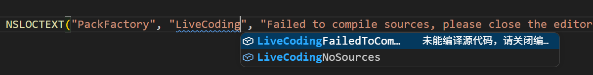
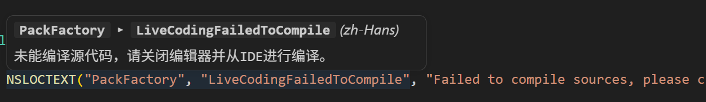
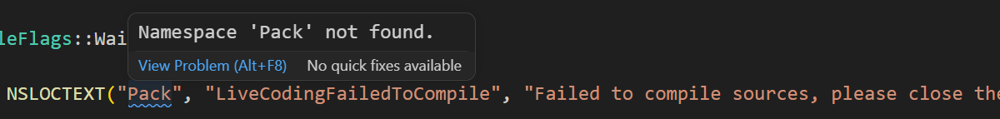
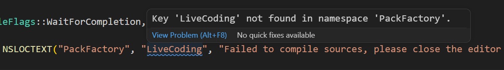
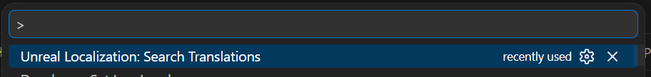
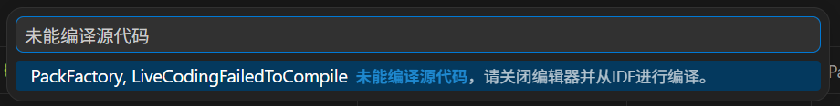

# Unreal Localization for VS Code

本插件在 VS Code 中加载 Unreal Engine 生成的 `.locres` 本地化资源，并将代码内的本地化调用与之关联，提供悬浮预览、自动补全和静态校验等编辑期辅助。

## 主要功能

### 1. 命名空间与 Key 自动补全 (Completion)

在引号内输入时，插件会依据光标所在位置，列出全部可用的命名空间，或当前命名空间下的 Key 列表，并附带译文预览以辅助选择。



### 2. 悬浮翻译预览 (Hover)

将光标停留于本地化调用之上，编辑器即可弹出当前 `defaultCulture` 所对应的译文，无需在多个文件之间切换查阅。



### 3. 缺失项静态校验 (Diagnostics)

插件会扫描代码中的本地化调用，对在 `.locres` 中无法解析的命名空间或 Key 进行高亮提示，便于在编码阶段及早发现遗漏，避免问题遗留至运行期。诊断的严重等级可按需配置。





### 4. 翻译条目检索 (Search Translations)

通过命令面板执行 `Unreal Localization: Search Translations`，可按命名空间、Key 或译文进行模糊检索。选中目标条目后，插件会将 `namespace, key` 写入剪贴板，可直接粘贴使用。





## 配置说明

在 VS Code 设置中搜索 `unreal-localization`，或在 `.vscode/settings.json` 中显式配置：

```jsonc
{
  // 作为数据源的文化标识，对应 <path>/<defaultCulture>/*.locres
  "unreal-localization.defaultCulture": "zh-Hans",

  // 本地化目标路径列表，支持多个条目
  // 相对路径以每个 workspace folder 为基准，绝对路径直接生效
  // 插件会加载每个路径下 <defaultCulture>/ 中的全部 .locres 文件
  "unreal-localization.paths": ["Content/Localization/Game"],

  // 识别为本地化调用的模板规则
  // 占位符 <ns> 和 <key> 分别捕获命名空间与 Key
  // 模板中的引号可匹配 ' 或 "，空白字符按宽松规则处理
  "unreal-localization.patterns": [{ "files": ["**/*.{h,cpp}"], "template": "NSLOCTEXT('<ns>', '<key>')" }],

  // 诊断严重等级：hint | information | warning | error
  "unreal-localization.diagnosticsSeverity": "information",
}
```

`.locres` 文件发生变更时，插件会自动重新加载；如需手动触发，可通过命令面板执行 `Unreal Localization: Reload`。
